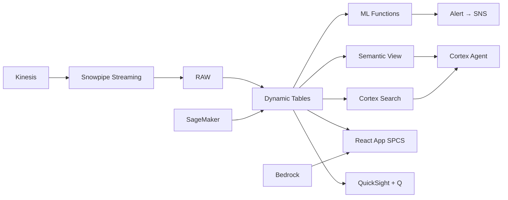

# Cross-Border Remittance Analytics & Corridor Intelligence

10M OFWs send $36B home annually through 200+ corridors — Snowflake processes remittance streams in real-time, builds corridor analytics with Dynamic Tables, and enables Cortex Agent-powered intelligence for compliance and operations.

## Architecture

The Philippines receives $36 billion in remittances annually from 10 million OFWs working across 210 corridors worldwide. A leading Philippine remittance company processes ₱1.8 trillion quarterly — but corridor analytics lives in spreadsheets updated weekly, missing real-time spikes, seasonal patterns, and competitive threats. Snowflake transforms this into a real-time intelligence platform.



## Snowflake Capabilities

| Capability | Implementation |
|-----------|---------------|
| Dynamic Tables | CORRIDOR_ANALYTICS / SENDER_BEHAVIOR / PAYOUT_PERFORMANCE / CORRIDOR_TIMESERIES |
| ML Functions | ML.FORECAST + ML.ANOMALY_DETECTION |
| Cortex AI | COMPLETE, AI_CLASSIFY |
| Cortex Search | 48 documents indexed |
| Cortex Agent | REMITTANCE_INTELLIGENCE_AGENT |
| Semantic View | REMITTANCE_ANALYTICS |
| React App (SPCS) | 5 tabs + DemoGuide |


## AWS Services

| Service | Role in Demo |
|---------|-------------|
| Amazon Kinesis | Stream 2.4M remittance transactions in real-time |
| Amazon DynamoDB | Low-latency transaction lookup and sender profiles |
| Amazon SageMaker | Corridor volume forecasting and anomaly detection |
| Amazon Bedrock (Claude) | Natural language corridor intelligence queries |
| Amazon QuickSight + Q | Remittance operations dashboard |
| Amazon SNS | Alert notifications for volume spikes and settlement delays |


## Personas

| Persona | Role | Key Questions |
|---------|------|---------------|
| **Carmen Luisa Uy-Tiongco** | Chief Operations Officer | "Which corridors grew fastest this quarter?" "What's our total transaction volume in pesos today?" |
| **Kenneth Aldrin Reyes** | Corridor Analytics Manager | "What's the Saudi Arabia corridor volume trend?" "Show me the peak sending patterns for US corridor." |


## Data

| Table | Rows | Description |
|-------|------|-------------|
| CORRIDORS | 210 | Send-receive corridor definitions (country pairs) |
| TRANSACTIONS | 2,400,000 | 90 days of remittance transactions via Kinesis |
| SENDERS | 850,000 | OFW sender profiles (anonymized) |
| RECEIVERS | 920,000 | Philippine beneficiary profiles (anonymized) |
| PAYOUT_AGENTS | 14,500 | Payout network (banks, pawnshops, e-wallets, door-to-door) |
| FX_RATES | 75,000 | Historical FX rates for all corridors |
| BSP_REPORTS | 48 | BSP (Bangko Sentral) quarterly remittance statistics |


## Build Instructions

### Prerequisites
- Snowflake account with ACCOUNTADMIN access
- Cortex AI enabled (ML Functions, Search, Agent)
- Warehouse: REMIT_WH (Medium)
- AWS CLI with access (us-west-2)

### Deployment

```bash
snowsql -f snowflake/00_setup.sql
snowsql -f snowflake/01_marketplace_install.sql
snowsql -f snowflake/02_raw_tables.sql
snowsql -f snowflake/03_staging.sql
snowsql -f snowflake/04_dynamic_tables.sql
snowsql -f snowflake/05_search.sql
snowsql -f snowflake/06_ml_models.sql
snowsql -f snowflake/07_semantic_view.sql
snowsql -f snowflake/08_agent.sql
```

### React App (SPCS)
```bash
cd app && npm ci && npm run build
docker build -t aws-philippines-remittance-cross-border-app .
docker push bdiqc8sm-default.registry.snowflakecomputing.com/remittance_ops/app/aws_philippines_remittance_cross_border/app:latest
```

### Demo Mode
Open the app URL with `?demo=true` for presenter view.

## Build Modes

### Snowflake Only
Run scripts 00-08 (skip AWS-specific integration). Uses:
- **Snowpipe Streaming SDK (direct)** instead of Amazon Kinesis
- **Dynamic Tables (materialized views)** instead of Amazon DynamoDB
- **ML.FORECAST + ML.ANOMALY_DETECTION (native)** instead of Amazon SageMaker
- **Cortex Agent + Cortex Analyst** instead of Amazon Bedrock (Claude)
- **Snowflake Intelligence (Cortex Analyst)** instead of Amazon QuickSight + Q
- **Alerts + Notification Integration** instead of Amazon SNS

### Full AWS + Snowflake
Run all scripts including AWS integration. Deploy QuickSight dashboard from `quicksight/`.

## Business Impact

Industry research and Snowflake customer outcomes:
- **Philippine remittances reached $36.1B in 2023 — 8.5% of GDP** — [BSP](https://www.bsp.gov.ph/Statistics/External/ofw.aspx)
- **10 million OFWs support 40% of Philippine households via remittances** — [PSA Philippines](https://psa.gov.ph/statistics/survey/labor-and-employment)
- **Digital remittance channels grew 35% in Philippines during 2023** — [World Bank](https://remittanceprices.worldbank.org/en/countrycorridor/Philippines)
- **Real-time transaction monitoring reduces fraud losses 45% in payments** — [McKinsey Payments](https://www.mckinsey.com/industries/financial-services/our-insights/global-payments)


## Key Demo Numbers

- **₱1.8T** processed in 90 days across 210 corridors
- **2.4M transactions** ingested via Snowpipe Streaming
- **210 corridors** monitored with ML.ANOMALY_DETECTION
- **14,500 payout points** banks, pawnshops, e-wallets tracked
- **42%** of payouts now via e-wallets (GCash/Maya)
- **3 corridors** flagged anomalous (volume 3x above normal)


## License

Apache 2.0 — See [LICENSE](LICENSE) for details.

This is a personal demo project and is not an official Snowflake offering. It comes with no support or warranty.